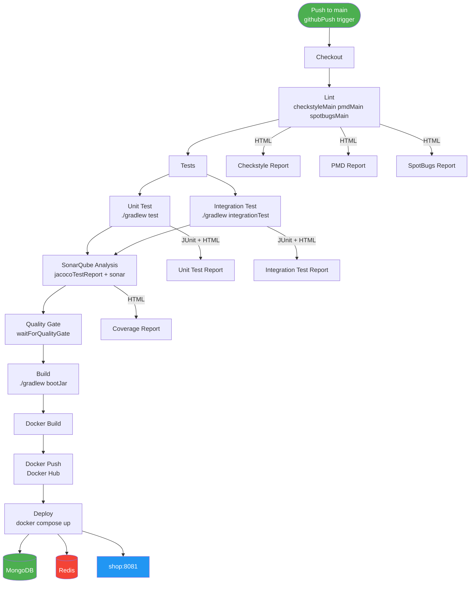

# CI/CD Pipeline

This project uses a Jenkins declarative pipeline to lint, test, analyse, build, and deploy the application automatically on every push to `main`.

---

## Infrastructure

| Component | Technology | Purpose |
|---|---|---|
| CI/CD server | Jenkins (Docker container) | Runs the pipeline |
| Docker daemon | Docker-in-Docker (DinD) | Builds and runs containers inside Jenkins |
| Image registry | Docker Hub (`nelsonvillam/shop`) | Stores built images |
| Code quality | SonarCloud | Static analysis and quality gate |
| Database | MongoDB 7 | Persistent data store |
| Cache | Redis 7 | Application-level caching |

Jenkins and DinD run as Docker containers on the same host, connected via a shared Docker network. Jenkins communicates with the DinD daemon over TLS on port 2376.

---

## Trigger

```groovy
triggers {
    githubPush()
}
```

The pipeline runs automatically whenever GitHub sends a push webhook to Jenkins. The webhook is configured in the GitHub repository under **Settings → Webhooks**.

### Local Jenkins with ngrok

When Jenkins is running locally (not publicly accessible), ngrok is used to expose it temporarily:

```bash
ngrok http 8080
```

The generated URL (e.g. `https://abc123.ngrok.io`) is set as the **Payload URL** in the GitHub webhook:

```
https://abc123.ngrok.io/github-webhook/
```

> The ngrok URL changes on every restart. For a stable setup, `pollSCM` is an alternative.

---

## Environment Variables

These are set globally for all stages:

| Variable | Value | Purpose |
|---|---|---|
| `IMAGE_NAME` | `nelsonvillam/shop` | Docker Hub image name |
| `IMAGE_TAG` | `${BUILD_NUMBER}` | Unique tag per build |
| `GRADLE_USER_HOME` | `${WORKSPACE}/.gradle` | Redirects Gradle cache into the workspace to avoid permission errors in Docker containers |
| `SONAR_USER_HOME` | `${WORKSPACE}/.sonar` | Redirects SonarQube cache into the workspace for the same reason |

Stages that run inside a Docker container also pass `-e HOME=${WORKSPACE}` via `args`. This is scoped to the container only (not the global env block) so that Docker credential lookups on the Jenkins host are not disrupted.

---

## Pipeline Stages



Unit Test and Integration Test run in **parallel** inside the `Tests` stage with `failFast true` — if either fails, the other is cancelled immediately.

---

### 1. Checkout

Pulls the latest code from GitHub.

```groovy
checkout scm
```

---

### 2. Lint

Runs inside an `eclipse-temurin:21-jdk` container. Executes three static analysis tools against the main source set.

```bash
./gradlew checkstyleMain pmdMain spotbugsMain --no-daemon
```

| Tool | What it checks | Config file |
|---|---|---|
| Checkstyle | Code style: naming, imports, formatting | `config/checkstyle/checkstyle.xml` |
| PMD | Best practices and error-prone patterns | `config/pmd/ruleset.xml` |
| SpotBugs | Bug patterns in compiled bytecode | `config/spotbugs/exclude.xml` |

A fourth tool, **ErrorProne**, runs automatically during compilation inside every stage that compiles Java — it requires no separate task.

The build fails immediately if any violation is found. HTML reports for all three tools are published to Jenkins after the build.

---

### 3. Tests (parallel)

Unit Test and Integration Test run simultaneously. `failFast true` cancels the remaining stage if either fails.

#### Unit Test

Runs inside an `eclipse-temurin:21-jdk` container.

```bash
./gradlew test --no-daemon
```

- Runs all test classes **not** ending in `IT`
- JUnit XML results published to Jenkins
- HTML test report published to Jenkins

#### Integration Test

Runs directly on the Jenkins host (no Docker container) so Testcontainers can reach the Docker daemon and spin up a real MongoDB instance.

```bash
./gradlew integrationTest --no-daemon
```

- Runs only classes ending in `IT`
- Testcontainers proxy socket at `/tmp/docker-tc-proxy.sock` is used when running inside Jenkins to redirect Docker socket access
- JUnit XML results published to Jenkins
- HTML test report published to Jenkins

---

### 4. SonarQube Analysis

Runs inside an `eclipse-temurin:21-jdk` container. Merges coverage data from both test runs and sends the full analysis to SonarCloud.

```bash
./gradlew jacocoTestReport sonar --no-daemon
```

- Merges `build/jacoco/test.exec` and `build/jacoco/integrationTest.exec` into a single JaCoCo report
- Sends source, bytecode, and coverage XML to SonarCloud
- Requires the `sonarqube` server configured in **Manage Jenkins → System → SonarQube servers**
- Requires **Automatic Analysis** disabled in SonarCloud (**Administration → Analysis Method**)
- The SonarCloud token is injected by `withSonarQubeEnv('sonarqube')` from Jenkins credentials

Coverage HTML report published to Jenkins after the build.

---

### 5. Quality Gate

Waits up to 5 minutes for SonarCloud to finish evaluating the analysis. If the gate fails, the pipeline is aborted — no artifact is built or deployed.

```groovy
timeout(time: 5, unit: 'MINUTES') {
    waitForQualityGate abortPipeline: true
}
```

The default **Sonar way** gate checks new code only:

| Condition | Threshold |
|---|---|
| Coverage on New Code | ≥ 80% |
| Duplicated Lines on New Code | ≤ 3% |
| Maintainability Rating | A |
| Reliability Rating | A |
| Security Rating | A |
| Security Hotspots Reviewed | 100% |

---

### 6. Build

Runs inside an `eclipse-temurin:21-jdk` container. Produces the runnable fat JAR.

```bash
./gradlew bootJar --no-daemon
```

Output: `build/libs/shop-0.0.1-SNAPSHOT.jar`

---

### 7. Docker Build

Builds and tags the application image with both the build number and `latest`.

```bash
docker build -t nelsonvillam/shop:<BUILD_NUMBER> .
docker tag nelsonvillam/shop:<BUILD_NUMBER> nelsonvillam/shop:latest
```

---

### 8. Docker Push

Pushes both tags to Docker Hub. No `docker login` step runs in the pipeline — credentials are stored as a plain base64 token in `~/.docker/config.json` on the Jenkins host (the `credsStore` key is removed to avoid macOS Keychain lookups that Jenkins cannot perform).

```bash
docker push nelsonvillam/shop:<BUILD_NUMBER>
docker push nelsonvillam/shop:latest
```

---

### 9. Deploy

Stops any running instance and brings up the full stack using `docker compose`. MongoDB credentials are injected from Jenkins secrets.

```bash
docker stop shop || true
docker rm shop || true
docker compose down --remove-orphans || true
docker compose up -d
```

---

## HTML Reports

All reports are published in the `post { always { } }` block so they appear even on failed builds.

| Report | Source | When useful |
|---|---|---|
| Checkstyle Report | `build/reports/checkstyle/main.html` | See exact style violations with file and line |
| PMD Report | `build/reports/pmd/main.html` | See best-practice violations with rule descriptions |
| SpotBugs Report | `build/reports/spotbugs/main.html` | See bug patterns with severity and class context |
| Unit Test Report | `build/reports/tests/test/index.html` | See which unit tests passed, failed, or were skipped |
| Integration Test Report | `build/reports/tests/integrationTest/index.html` | See which integration tests passed, failed, or were skipped |
| Coverage Report | `build/reports/jacoco/test/html/index.html` | See line and branch coverage by class |

> If reports appear unstyled, run the following in **Manage Jenkins → Script Console**:
> ```groovy
> System.setProperty("hudson.model.DirectoryBrowserSupport.CSP", "")
> ```

---

## Deployment Stack (`docker-compose.yml`)

Three services start together on the same Docker network:

| Service | Image | Port |
|---|---|---|
| `mongo` | `mongo:7` | 27017 (internal) |
| `redis` | `redis:7-alpine` | 6379 (internal) |
| `shop` | `nelsonvillam/shop:latest` | **8081 → 8080** |

The shop service connects to MongoDB using:
```
mongodb://<user>:<password>@mongo:27017/shop?authSource=admin
```

`authSource=admin` is required because the root user created by `MONGO_INITDB_ROOT_USERNAME` is stored in the `admin` database.

Data is persisted across deployments via named Docker volumes (`mongo-data`, `redis-data`).

---

## Jenkins Credentials

| Credential ID | Type | Used in stage |
|---|---|---|
| `dockerhub-creds` | Username/Password | Docker Push (legacy — now unused; credentials stored in `~/.docker/config.json`) |
| `mongo-user` | Secret text | Deploy |
| `mongo-password` | Secret text | Deploy |
| `sonarqube` | Secret text (token) | SonarQube Analysis (injected by `withSonarQubeEnv`) |

---

## Accessing the Deployed App

After a successful pipeline run the app is available at:

| URL | Description |
|---|---|
| `http://localhost:8081/swagger-ui/index.html` | Swagger UI |
| `http://localhost:8081/v3/api-docs` | Raw OpenAPI spec |
| `http://localhost:8081/api/products` | Products endpoint |
| `http://localhost:8081/api/customers` | Customers endpoint |
| `http://localhost:8081/api/orders` | Orders endpoint |

> Port 8080 is occupied by Jenkins. The app is always exposed on **8081**.
