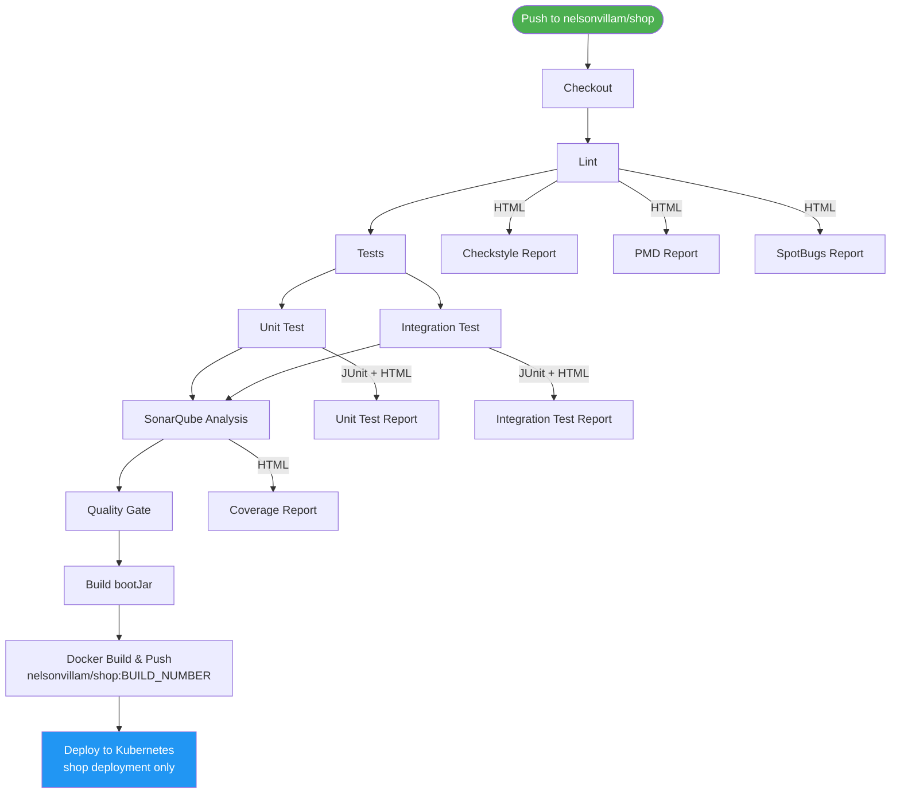
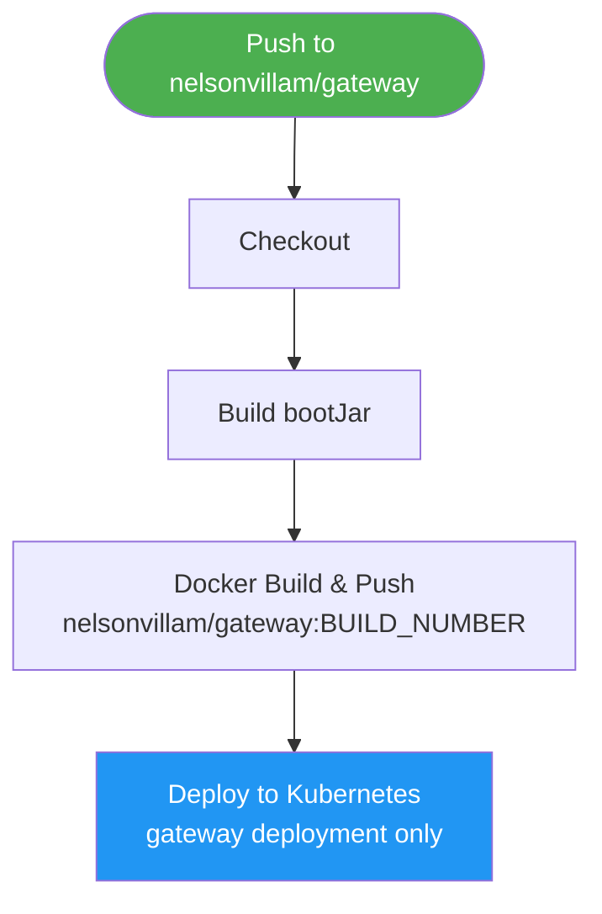
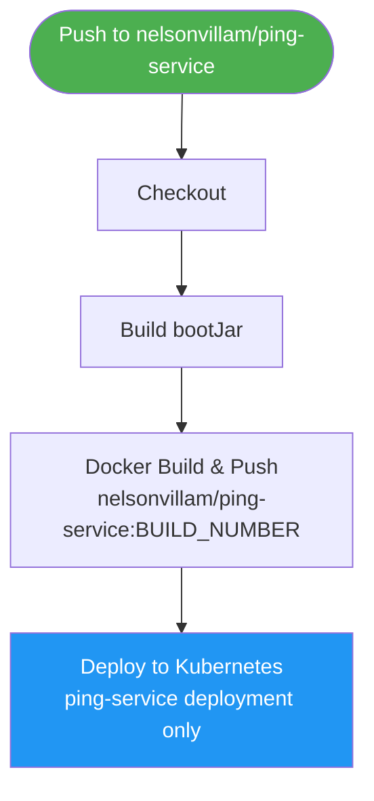

# CI/CD Pipeline

The project is split into four independent GitHub repositories, each with its own Jenkins pipeline. A push to any repository triggers only that service's pipeline — other services are unaffected.

| Repository | GitHub | Pipeline scope |
|---|---|---|
| `shop` | `nelsonvillam/shop` | Lint → test → SonarQube → build → push → deploy |
| `gateway` | `nelsonvillam/gateway` | Build → push → deploy |
| `ping-service` | `nelsonvillam/ping-service` | Build → push → deploy |
| `infra` | `nelsonvillam/infra` | Shared k8s infra (MongoDB, Redis, Zipkin, ESO) — no pipeline |

---

## Infrastructure

| Component | Technology | Purpose |
|---|---|---|
| CI/CD server | Jenkins (Docker container) | Runs the pipelines |
| Docker daemon | Docker-in-Docker (DinD) | Builds and runs containers inside Jenkins |
| Image registry | Docker Hub (`nelsonvillam/*`) | Stores built images |
| Code quality | SonarCloud | Static analysis and quality gate (shop only) |
| Database | MongoDB 7 | Persistent data store |
| Cache | Redis 7 | Application-level caching |

Jenkins and DinD run as Docker containers on the same host, connected via a shared Docker network. Jenkins communicates with the DinD daemon over TLS on port 2376.

---

## Trigger

```groovy
triggers {
    githubPush()
}
```

Each pipeline runs automatically whenever GitHub sends a push webhook to Jenkins. The webhook is configured per repository under **Settings → Webhooks**.

### Local Jenkins with ngrok

When Jenkins is running locally (not publicly accessible), ngrok is used to expose it temporarily:

```bash
ngrok http 8080
```

The generated URL (e.g. `https://abc123.ngrok.io`) is set as the **Payload URL** in each GitHub repository's webhook:

```
https://abc123.ngrok.io/github-webhook/
```

> The ngrok URL changes on every restart. For a stable setup, `pollSCM` is an alternative.

---

## Pipelines

### shop pipeline (full)



### gateway pipeline (simple)



### ping-service pipeline (simple)



---

## Environment Variables

Each pipeline defines only the variables it needs:

### shop

| Variable | Value | Purpose |
|---|---|---|
| `IMAGE_NAME` | `nelsonvillam/shop` | Docker Hub image name |
| `IMAGE_TAG` | `${BUILD_NUMBER}` | Unique tag per build |
| `GRADLE_USER_HOME` | `${WORKSPACE}/.gradle` | Redirects Gradle cache into workspace |
| `SONAR_USER_HOME` | `${WORKSPACE}/.sonar` | Redirects SonarQube cache into workspace |
| `AWS_REGION` | `sa-east-1` | AWS region for ESO → Secrets Manager |

### gateway / ping-service

| Variable | Value | Purpose |
|---|---|---|
| `IMAGE_NAME` | `nelsonvillam/gateway` or `nelsonvillam/ping-service` | Docker Hub image name |
| `IMAGE_TAG` | `${BUILD_NUMBER}` | Unique tag per build |
| `GRADLE_USER_HOME` | `${WORKSPACE}/.gradle` | Redirects Gradle cache into workspace |

---

## Stage Details

### shop — Stage 1: Checkout

Pulls the latest code from `nelsonvillam/shop`.

### shop — Stage 2: Lint

Runs inside an `eclipse-temurin:21-jdk` container. Executes three static analysis tools against the main source set.

```bash
./gradlew checkstyleMain pmdMain spotbugsMain --no-daemon
```

| Tool | What it checks | Config file |
|---|---|---|
| Checkstyle | Code style: naming, imports, formatting | `config/checkstyle/checkstyle.xml` |
| PMD | Best practices and error-prone patterns | `config/pmd/ruleset.xml` |
| SpotBugs | Bug patterns in compiled bytecode | `config/spotbugs/exclude.xml` |

A fourth tool, **ErrorProne**, runs automatically during every compilation stage — it requires no separate task.

### shop — Stage 3: Tests (parallel)

Unit Test and Integration Test run simultaneously. `failFast true` cancels the other if either fails.

#### Unit Test

```bash
./gradlew test --no-daemon
```

Runs inside `eclipse-temurin:21-jdk`. Runs all classes **not** ending in `IT`. JUnit XML + HTML report published to Jenkins.

#### Integration Test

```bash
./gradlew integrationTest --no-daemon
```

Runs on the Jenkins host (no Docker container) so Testcontainers can reach the Docker daemon and spin up a real MongoDB instance. Runs only classes ending in `IT`.

### shop — Stage 4: SonarQube Analysis

```bash
./gradlew jacocoTestReport sonar --no-daemon
```

Merges coverage from both test runs and sends the analysis to SonarCloud. Requires `withSonarQubeEnv('sonarqube')`.

### shop — Stage 5: Quality Gate

Waits up to 5 minutes for SonarCloud to confirm the gate passes. Aborts the pipeline if it fails — nothing is built or deployed.

| Condition | Threshold |
|---|---|
| Coverage on New Code | ≥ 80% |
| Duplicated Lines on New Code | ≤ 3% |
| Maintainability / Reliability / Security Rating | A |

### All services — Build

Runs inside `eclipse-temurin:21-jdk`. Produces the fat JAR.

```bash
./gradlew bootJar --no-daemon
```

### All services — Docker Build & Push

Builds and pushes a multi-architecture image (`linux/amd64` + `linux/arm64`) tagged with both the build number and `latest`:

```bash
docker buildx build \
    --platform linux/amd64,linux/arm64 \
    -t ${IMAGE_NAME}:${IMAGE_TAG} \
    -t ${IMAGE_NAME}:latest \
    --push .
```

No `docker login` step runs in the pipeline — credentials are stored as a plain base64 token in `~/.docker/config.json` on the Jenkins host.

### All services — Deploy to Kubernetes

Each pipeline deploys **only its own service**. The shop pipeline additionally refreshes AWS credentials and waits for ESO to sync secrets (since shop depends on `shop-secret`).

**shop deploy:**
```bash
kubectl config use-context docker-desktop

# Refresh aws-credentials for ESO
kubectl create secret generic aws-credentials --namespace shop \
    --from-literal=access-key-id="..." --from-literal=secret-access-key="..." \
    --dry-run=client -o yaml | kubectl replace --force -f -

# Wait for secrets to sync
kubectl wait externalsecret/shop-secret --namespace shop --for=condition=Ready --timeout=120s

# Apply shop manifests with pinned tag
kubectl apply -f k8s/configmap.yaml
kubectl apply -f k8s/service.yaml
sed 's|nelsonvillam/shop:latest|nelsonvillam/shop:<BUILD_NUMBER>|g' \
    k8s/deployment.yaml | kubectl apply -f -

kubectl rollout status deployment/shop --namespace shop --timeout=5m
```

**gateway deploy:**
```bash
kubectl config use-context docker-desktop

sed 's|nelsonvillam/gateway:latest|nelsonvillam/gateway:<BUILD_NUMBER>|g' \
    k8s/deployment.yaml | kubectl apply -f -
kubectl apply -f k8s/service.yaml
kubectl apply -f k8s/ingress.yaml

kubectl rollout status deployment/gateway --namespace shop --timeout=5m
```

**ping-service deploy:**
```bash
kubectl config use-context docker-desktop

sed 's|nelsonvillam/ping-service:latest|nelsonvillam/ping-service:<BUILD_NUMBER>|g' \
    k8s/deployment.yaml | kubectl apply -f -
kubectl apply -f k8s/service.yaml

kubectl rollout status deployment/ping-service --namespace shop --timeout=5m
```

All pipelines roll back automatically on failure:
```bash
kubectl rollout undo deployment/<service> --namespace shop
```

---

## HTML Reports (shop only)

All reports are published in the `post { always { } }` block so they appear even on failed builds.

| Report | Source |
|---|---|
| Checkstyle Report | `build/reports/checkstyle/main.html` |
| PMD Report | `build/reports/pmd/main.html` |
| SpotBugs Report | `build/reports/spotbugs/main.html` |
| Unit Test Report | `build/reports/tests/test/index.html` |
| Integration Test Report | `build/reports/tests/integrationTest/index.html` |
| Coverage Report | `build/reports/jacoco/test/html/index.html` |

> If reports appear unstyled, run the following in **Manage Jenkins → Script Console**:
> ```groovy
> System.setProperty("hudson.model.DirectoryBrowserSupport.CSP", "")
> ```

---

## Services

### Kubernetes (primary — deployed by CI/CD)

All services run in the `shop` namespace and communicate via Kubernetes DNS:

| Service | Repo | Image | Internal port | Role |
|---|---|---|---|---|
| `gateway` | `nelsonvillam/gateway` | `nelsonvillam/gateway` | 8080 | API gateway — JWT validation, path-based routing |
| `shop` | `nelsonvillam/shop` | `nelsonvillam/shop` | 8080 | Main business API (2 replicas) |
| `ping-service` | `nelsonvillam/ping-service` | `nelsonvillam/ping-service` | 8080 | Test microservice |
| `mongo` | `nelsonvillam/infra` | `mongo:7` (StatefulSet) | 27017 | MongoDB replica set (3 nodes) |
| `redis` | `nelsonvillam/infra` | `redis:7-alpine` | 6379 | Application cache |
| `zipkin` | `nelsonvillam/infra` | `openzipkin/zipkin:3` | 9411 | Distributed tracing |

### docker-compose.yml (in `nelsonvillam/infra` — local testing without K8s)

| Service | Image | Port |
|---|---|---|
| `mongo` | `mongo:7` | 27017 (internal) |
| `redis` | `redis:7-alpine` | 6379 (internal) |
| `zipkin` | `openzipkin/zipkin:3` | **9411 → 9411** |
| `shop` | `nelsonvillam/shop:latest` | **8081 → 8080** |
| `ping-service` | `nelsonvillam/ping-service:latest` | **8082 → 8080** |

Data is persisted across deployments via named Docker volumes (`mongo-data`, `redis-data`).

---

## Jenkins Credentials

| Credential ID | Type | Used by |
|---|---|---|
| `aws-access-key-id` | Secret text | shop pipeline — ESO → Secrets Manager auth |
| `aws-secret-access-key` | Secret text | shop pipeline — ESO → Secrets Manager auth |
| `sonarqube` | Secret text (token) | shop pipeline — SonarQube Analysis |

---

## Deployment Order (fresh cluster)

Because each pipeline is independent, shared infrastructure must be deployed before any service:

1. Apply infra manifests (creates namespace, MongoDB, Redis, Zipkin, ESO, SecretStore):
   ```bash
   kubectl apply -k infra/k8s/overlays/local/
   ```
2. Trigger or manually run the **gateway** pipeline
3. Trigger or manually run the **shop** pipeline
4. Trigger or manually run the **ping-service** pipeline

On subsequent pushes each service deploys itself independently — no coordination needed.

---

## Accessing the Deployed App

After pipelines run the app is available via port-forward:

```bash
kubectl port-forward svc/gateway 9090:80 -n shop &
```

| URL | Description |
|---|---|
| `http://localhost:9090/swagger-ui/index.html` | Swagger UI |
| `http://localhost:9090/auth/login` | Login (POST) |
| `http://localhost:9090/ping` | Ping test service (no token required) |

> Port 8080 is occupied by Jenkins.
