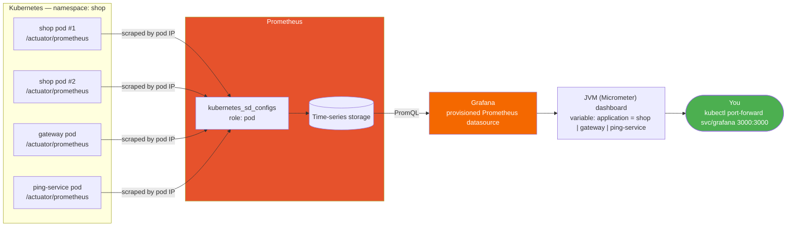

# Prometheus Metrics Collection — Spring Boot + Docker + Kubernetes

This document explains how metrics are collected and visualized end-to-end across the multi-repo system: `shop`, `gateway`, and `ping-service` each expose Micrometer/Prometheus metrics; a Prometheus server (deployed via the `infra` repo) scrapes all three on Kubernetes; and Grafana queries Prometheus to render dashboards.

For app-level metric concepts (custom counters, `@TrackCall`, Micrometer types), see [OBSERVABILITY.md](OBSERVABILITY.md) — this document focuses on wiring that up across services and deploying the collector + visualization layer.

---

## Architecture



| Repo | Role |
|---|---|
| `shop` | Already had `micrometer-registry-prometheus` — source of custom metrics like `shop.orders.placed` and `shop.api.calls` |
| `gateway` | Added `micrometer-registry-prometheus` so its own actuator can serve `/actuator/prometheus`, tagged `application: gateway` |
| `ping-service` | Same addition, tagged `application: ping-service` |
| `infra` | Deploys Prometheus (scrape config + RBAC) and Grafana (provisioned datasource) — the only repo that changes to add the collector/visualization layer |

---

## 1. Spring Boot side — exposing metrics per service

Every service needs two things to expose Prometheus metrics: the registry dependency, and the endpoint exposed via Actuator.

**Dependency** (`build.gradle`):
```groovy
implementation 'io.micrometer:micrometer-registry-prometheus'
```

**Exposure** (`application.properties` / `application.yml`):
```properties
management.endpoints.web.exposure.include=health,info,prometheus
```

`shop` already had both (plus `metrics` for the ad-hoc actuator browser). `gateway` and `ping-service` only had `spring-boot-starter-actuator` with `health`/`info` exposed — no Prometheus registry on the classpath, so `/actuator/prometheus` didn't exist as an endpoint at all.

### The gateway gotcha: silent proxying, not a 404

`gateway` routes everything unmatched through a catch-all Spring Cloud Gateway route (`Path=/** → shop`), and its `JwtAuthenticationFilter` treats `/actuator` as a public prefix. Before adding the Prometheus registry, hitting `gateway:8080/actuator/prometheus` didn't 404 — it returned **shop's own metrics**, mislabeled as coming from gateway. Spring's WebFlux dispatcher tries gateway's own actuator handler mapping first; since gateway didn't expose a `prometheus` endpoint, that mapping declined to handle the path, and the request fell through to the next matching handler — Spring Cloud Gateway's route predicate — which proxied it to `shop`.

This was caught by comparing response line counts (`gateway`'s `/actuator/prometheus` had the exact same 442 lines as `shop`'s) and by checking `curl gateway:80/actuator` — the root actuator listing didn't include a `prometheus` link at all, proving gateway itself never intended to serve that path.

Once `gateway` actually exposes its own `prometheus` endpoint, its actuator handler claims the path locally and the request never reaches the catch-all route. After redeploying, `gateway`'s `/actuator` root correctly lists `prometheus`, and its metrics output (195 lines, its own JVM/HTTP/gateway metrics) is distinct from `shop`'s.

**Lesson:** in a gateway with a catch-all proxy route, any path the gateway's own server doesn't explicitly handle silently falls through to the proxy instead of 404ing. Don't assume a 200 response means the service you targeted actually answered.

### Tagging metrics per service

`shop` already set:

```properties
management.metrics.tags.application=shop
```

This adds an `application="shop"` label to every metric it emits — needed once more than one service reports to the same Prometheus instance, otherwise there's no way to tell which service a given `jvm_memory_used_bytes` series came from. `gateway` and `ping-service` didn't have this, so it was added to match:

```yaml
management:
  metrics:
    tags:
      application: gateway   # or ping-service
```

This matters beyond just tidiness — the imported Grafana dashboard (see §4) filters everything through an `application` template variable, so without this tag a service is invisible in that dashboard even though Prometheus is scraping it correctly.

---

## 2. Docker — rebuilding images to pick up the change

Adding a Micrometer dependency to `build.gradle` has **zero effect on already-running pods** — the JAR inside the running container doesn't change until a new image is built and deployed.

Both `gateway` and `ping-service` have a `Jenkinsfile` that:
1. Triggers on `githubPush()`
2. Builds the JAR (`./gradlew bootJar`)
3. Builds and pushes a multi-arch Docker image: `docker buildx build --platform linux/amd64,linux/arm64 -t <image>:<build-number> -t <image>:latest --push .`
4. Deploys to Kubernetes: `kubectl apply` the deployment with the new image tag, then `kubectl rollout status`

After pushing the `build.gradle`/`application.yml` changes to GitHub, the Jenkins pipelines for `gateway` and `ping-service` were triggered manually, producing `gateway:3` and `ping-service:3` — the first images to actually include the Prometheus registry.

---

## 3. Kubernetes — deploying Prometheus itself

Lives entirely in the `infra` repo, under `k8s/base/prometheus/`:

| File | Purpose |
|---|---|
| `rbac.yaml` | `ServiceAccount` + namespaced `Role` (get/list/watch on `pods`, scoped to the `shop` namespace only — not cluster-wide) + `RoleBinding` |
| `configmap.yaml` | `prometheus.yml` — the scrape config, one job per service |
| `deployment.yaml` | Single-replica `prom/prometheus:v2.55.1`, config mounted from the ConfigMap, using the `prometheus` ServiceAccount |
| `service.yaml` | ClusterIP exposing Prometheus's UI/API on port 9090 |

All four are wired into `k8s/base/kustomization.yaml`, so both the `local` (Docker Desktop) and `eks` overlays pick them up automatically.

### Why per-pod discovery instead of a static target

The first version of the scrape config pointed at each service's Kubernetes `Service` DNS name directly:

```yaml
- job_name: shop
  metrics_path: /actuator/prometheus
  static_configs:
    - targets: ["shop:80"]
```

This is broken for any service with more than one replica. A `Service` load-balances across all matching pods, but each pod runs its own JVM with its own independent, in-memory Micrometer registry — counters aren't shared across replicas. Scraping through the Service means Prometheus samples whichever pod happens to answer that particular request, silently undercounting anything tracked per-pod (like `shop.api.calls`).

**Fix:** `kubernetes_sd_configs` with `role: pod`, scoped to the `shop` namespace, relabeled to keep only the right app's pods and scrape each one's IP directly — bypassing the Service entirely:

```yaml
- job_name: shop
  metrics_path: /actuator/prometheus
  kubernetes_sd_configs:
    - role: pod
      namespaces:
        names: ["shop"]
  relabel_configs:
    - source_labels: [__meta_kubernetes_pod_label_app]
      regex: shop
      action: keep
    - source_labels: [__meta_kubernetes_pod_phase]
      regex: Pending|Succeeded|Failed|Unknown
      action: drop
    - source_labels: [__meta_kubernetes_pod_container_port_number]
      regex: "8080"
      action: keep
    - source_labels: [__meta_kubernetes_pod_ip]
      regex: (.+)
      replacement: ${1}:8080
      target_label: __address__
    - source_labels: [__meta_kubernetes_pod_name]
      target_label: pod
    - source_labels: [__meta_kubernetes_namespace]
      target_label: namespace
```

`gateway` and `ping-service` use the identical pattern, just filtering on `app: gateway` / `app: ping-service`.

### RBAC — least privilege

Prometheus's `ServiceAccount` gets a **namespaced `Role`**, not a `ClusterRole` — `get`/`list`/`watch` on `pods`, scoped only to the `shop` namespace. That's the minimum permission `kubernetes_sd_configs` (role: pod) needs to discover targets; nothing cluster-wide is granted.

---

## 4. Kubernetes — deploying Grafana

Also in the `infra` repo, under `k8s/base/grafana/`:

| File | Purpose |
|---|---|
| `configmap.yaml` | Provisions the Prometheus datasource automatically (`http://prometheus:9090`, pinned `uid: prometheus`) — no manual "Add data source" step |
| `configmap-dashboard-provider.yaml` | Tells Grafana to load dashboards from a folder on disk (`/var/lib/grafana/dashboards`), polling every 30s |
| `configmap-dashboards.yaml` | The actual dashboard JSON, one key per dashboard — this *is* the dashboard, checked into git |
| `deployment.yaml` | Single-replica `grafana/grafana:11.3.1`, mounts all three ConfigMaps |
| `service.yaml` | ClusterIP exposing Grafana's UI on port 3000 |

Wired into `k8s/base/kustomization.yaml` alongside the Prometheus resources.

`GF_SECURITY_ADMIN_PASSWORD=admin` is set directly as a plain env var (not a Kubernetes `Secret`) — acceptable here because Grafana has no persistent volume and no `Ingress` exposes it outside the cluster; it's only reachable via `kubectl port-forward`, same as Prometheus.

### Dashboards are provisioned as code, not clicked together

Grafana has no persistent volume. Anything created through the UI or the `/api/dashboards/*` HTTP API only lives in the pod's ephemeral SQLite database — a restart wipes it, exactly like the admin password gotcha below. The fix is Grafana's built-in **file-based dashboard provisioning**: point a provider config at a directory, and Grafana loads (and periodically reloads) every `.json` file in it automatically, no API calls required.

Two dashboards are provisioned this way:

| Dashboard | Source | What it shows |
|---|---|---|
| `jvm-micrometer.json` | Downloaded from `grafana.com`'s public API (community dashboard id **4701**) | Heap/non-heap memory, GC pauses, thread count, uptime — filtered by `application` and `instance` variables |
| `shop-system-metrics.json` | Custom-built for this project | Business metrics (`shop.orders.placed` rate, `shop.api.calls` by controller/method) plus cross-service HTTP request rate, error rate, average/max latency, and thread-pool internals for `shop`, `gateway`, and `ping-service` side by side |

A dashboard downloaded from `grafana.com` references its datasource via a template placeholder (`"datasource": "${DS_PROMETHEUS}"`), meant to be resolved by Grafana's *import* API using an `inputs` array. File-based provisioning doesn't do that substitution, so before dropping the JSON into the ConfigMap it needs the placeholder replaced with the datasource's actual name (`"Prometheus"`) — a plain string search-and-replace, since Grafana resolves legacy string-style datasource references by name.

Both dashboards also get an explicit `"uid"` set in their JSON (`jvm-micrometer`, `shop-system-metrics`). Without it, Grafana auto-generates a random uid on every fresh load — meaning the dashboard's URL would change on every pod restart.

---

## 5. Deploying and verifying

```bash
# Deploy (local overlay shown; same command with overlays/eks/ for the live cluster)
kubectl apply -k k8s/overlays/local/

# Confirm both pods are up
kubectl rollout status deployment/prometheus -n shop
kubectl rollout status deployment/grafana -n shop

# Port-forward to check scrape targets
kubectl port-forward -n shop svc/prometheus 9091:9090 &
curl -s http://localhost:9091/api/v1/targets | jq '.data.activeTargets[] | {job: .labels.job, pod: .labels.pod, health}'
```

Every target should report `"health": "up"`. To confirm the data is real (not proxied or duplicated), query an actual metric per job and check the values are distinct and plausible, e.g. process uptime should roughly match each pod's actual age:

```bash
curl -s --data-urlencode 'query=process_uptime_seconds{job="shop"}' \
  http://localhost:9091/api/v1/query | jq '.data.result[] | {pod: .metric.pod, uptime: .value[1]}'
```

To verify Grafana end-to-end (not just Prometheus directly), query through Grafana's own datasource proxy — this exercises the exact path the UI uses. The datasource uid is pinned to `prometheus`, so it's always this exact URL:

```bash
kubectl port-forward -n shop svc/grafana 3000:3000 &

curl -s -u admin:admin -G "http://localhost:3000/api/datasources/proxy/uid/prometheus/api/v1/query" \
  --data-urlencode 'query=process_uptime_seconds{application="gateway"}'
```

To prove the dashboards themselves survive a restart (not just work right now), delete the pod and confirm they reappear with zero manual steps:

```bash
kubectl delete pod -n shop -l app=grafana
kubectl rollout status deployment/grafana -n shop

curl -s -u admin:admin "http://localhost:3000/api/search?type=dash-db" | jq '.[].uid'
# jvm-micrometer
# shop-system-metrics
```

To open it yourself: `kubectl port-forward -n shop svc/grafana 3000:3000`, then `http://localhost:3000/d/shop-system-metrics/` or `http://localhost:3000/d/jvm-micrometer/` (login `admin`/`admin`).

---

## 6. Gotchas encountered

| Gotcha | Symptom | Fix |
|---|---|---|
| Gateway's catch-all route masks unexposed actuator paths | `/actuator/prometheus` on gateway returned **200** with shop's own metrics instead of 404 | Add the Prometheus registry + exposure to gateway so its own actuator claims the path before it ever reaches the `Path=/**` route |
| Static Service-based scrape targets undercount multi-replica services | Only one of shop's 2 replicas got scraped per tick; per-pod counters looked incomplete | `kubernetes_sd_configs` (role: pod) — scrape every pod individually by IP |
| A new Micrometer dependency needs a fresh image | Editing `build.gradle` had no effect on the running pods | Trigger the Jenkins pipeline (build → buildx push → `kubectl apply` + rollout) after any dependency/config change |
| Grafana dashboard variable silently hides a service | Dashboard 4701's `application` variable only ever listed `shop` even though gateway/ping-service were being scraped fine | Add `management.metrics.tags.application` to gateway/ping-service — the dashboard filters by that label, not by Prometheus `job` |
| Grafana admin password can drift from what's in the manifest | API calls with `admin:admin` started failing with `password-auth.failed` after someone logged into the UI (Grafana prompts to change the default password) | `kubectl exec` into the pod and run `grafana cli admin reset-admin-password admin` to restore the known password — fine here since there's no persistent volume and no external exposure |
| No persistent volume means dashboards/datasources are ephemeral | A dashboard created via the API worked fine until the pod restarted, then it — and the auto-generated datasource uid it referenced — were both gone | Provision dashboards as ConfigMap-mounted JSON files (file-based provisioning) instead of the API, and pin explicit `uid`s on the datasource and both dashboards so nothing regenerates randomly on restart |

---

## Files touched, by repo

| Repo | File | Change |
|---|---|---|
| `gateway` | `build.gradle` | + `io.micrometer:micrometer-registry-prometheus` |
| `gateway` | `application.yml` | `exposure.include: health,info,prometheus`, `metrics.tags.application: gateway` |
| `ping-service` | `build.gradle` | + `io.micrometer:micrometer-registry-prometheus` |
| `ping-service` | `application.yml` | `exposure.include: health,prometheus`, `metrics.tags.application: ping-service` |
| `infra` | `k8s/base/prometheus/rbac.yaml` | new — `ServiceAccount`/`Role`/`RoleBinding` |
| `infra` | `k8s/base/prometheus/configmap.yaml` | new — scrape config, 3 jobs, per-pod discovery |
| `infra` | `k8s/base/prometheus/deployment.yaml` | new — Prometheus server |
| `infra` | `k8s/base/prometheus/service.yaml` | new — ClusterIP :9090 |
| `infra` | `k8s/base/grafana/configmap.yaml` | new — provisioned Prometheus datasource, pinned `uid: prometheus` |
| `infra` | `k8s/base/grafana/configmap-dashboard-provider.yaml` | new — file-based dashboard provisioning config |
| `infra` | `k8s/base/grafana/configmap-dashboards.yaml` | new — the `jvm-micrometer` and `shop-system-metrics` dashboard JSON |
| `infra` | `k8s/base/grafana/deployment.yaml` | new — Grafana server, mounts all three ConfigMaps |
| `infra` | `k8s/base/grafana/service.yaml` | new — ClusterIP :3000 |
| `infra` | `k8s/base/kustomization.yaml` | wired all nine new resources in |

## Related docs

- [OBSERVABILITY.md](OBSERVABILITY.md) — app-level Micrometer/Actuator setup, custom counters, `@TrackCall`
- [API_GATEWAY.md](API_GATEWAY.md) — gateway routing and JWT auth (relevant to the catch-all proxy gotcha above)
- [LOCAL_KUBERNETES.md](LOCAL_KUBERNETES.md) / [AWS_EKS_SETUP.md](AWS_EKS_SETUP.md) — cluster setup for the `local` / `eks` kustomize overlays
